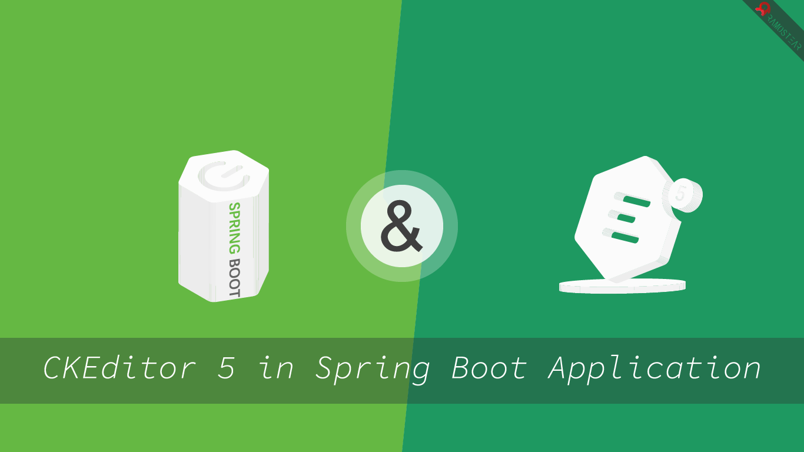
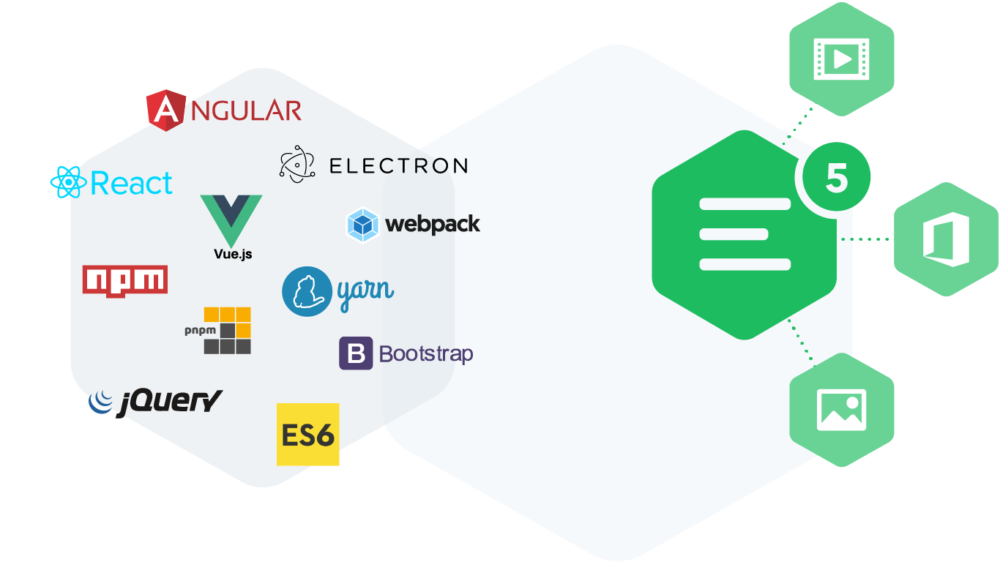

> 在本项目中，我将介绍如何在Spring Boot Application中使用CKEditor编辑器。内容包括SpringBoot文件上传，SpringData JPA数据持久化，CKEditor图片上传，CKEditor插入视频，获取/设置CKEditor内容等。



## 环境准备

工欲善其事必先利其器，在开始系列介绍之前，先了解一下本系列文章所涉及到的相关软件：

1. Java Development Kit：JDK 1.8及以上版本
2. Maven：Maven 3.0及以上版本
3. MySQL：MySQL 5.5及以上版本
4. IDE：IntelliJ IDEA 2019.2及以上版本
5. Browser：Chrome/FireFox

> 提示：
>
> 对于IDE的使用，你可以根据自己的编程习惯进行选择，IntelliJ IDEA不是硬性要求，你也可以使用Eclipse进行编码，如果你偏向于使用Eclipse,笔者推荐使用[Spring](https://spring.io/)提供的[Spring Tools 4 for Eclipse](https://spring.io/tools)


## 获取源码

本系列文章的项目源码同步更新至[码云](https://github.com) 和 [Github](https://github.com) ，你可以任选其一下载源码到本地。项目地址如下：

1. 码云：[https://gitee.com/ramostear/CKEditor5-SpringBoot](https://gitee.com/ramostear/CKEditor5-SpringBoot)
2. Github：[https://github.com/ramostear/CKEditor5-SpringBoot](https://github.com/ramostear/CKEditor5-SpringBoot)

你也可以通过Git命令行工具下载项目源码，命令如下(二者任选其一)：

```shell
git clone https://gitee.com/ramostear/CKEditor5-SpringBoot.git
```

```shell
git clone https://github.com/ramostear/CKEditor5-SpringBoot.git
```


## CKEditor

[CKEditor](https://ckeditor.com/) 是一个基于浏览器的“所见即所得”内容编辑器。CKEditor旨在将Web编辑器(如Microsoft Word、OpenOffice和WPS等)中常见的文字处理器功能引入Web界面。CKEditor在用户交互界面，插入内容，创作内容等方面为用户提供了众多的功能。截至发稿时，CKEditor共有五个版本，在本系列教程中，我将使用CKEditor5进行演示。如需查看CKEditor功能演示，请访问：[https://ckeditor.com/ckeditor-5](https://ckeditor.com/ckeditor-5)



##  内容概述

为了便于查找和阅读，现将本系列的文章地址列举如下（你可根据自己的需要，选择性阅读）：

1. [CKEditor 5 + SpringBoot实战(一)：项目简介](#)
2. [CKEditor 5 + SpringBoot实战(二)：SpringBoot Application环境搭建](#)
3. [CKEditor 5 + SpringBoot实战(三)：SpringData JPA数据持久化](#)
4. [CKEditor 5 + SpringBoot实战(四)：SpringBoot 实现文件上传](#)
5. [CKEditor 5 + SpringBoot实战(五)：SpringBoot & Freemarker整合](#)
6. [CKEditor 5 + SpringBoot实战(六)：CKEditor5的安装与初始化](#)
7. [CKEditor 5 + SpringBoot实战(七)：SpringBoot连接MySQL数据库]()
8. [CKEditor 5 + SpringBoot实战(八)：CKEditor5上传文件到服务端](#)
9. [CKEditor 5 + SpringBoot实战(九)：CKEditor5插入视频](#)
10. [CKEditor 5 + SpringBoot实战(十)：CKEditor5与SpringBoot进行数据交互](#)


## 本章小结

本系列文章中的项目只做学习交流用，项目只是为了对应相应的知识点而设计，并非一个完整的生产可用项目，你可以在此基础上对其他功能进行完善（如：权限，性能，流程，交互等），希望读者理解万岁！如果你在阅读本系列文章和项目源码的过程中发现不足之处，欢迎与我联系(Email：ramostear@163.com)，或将你的代码推送到对应的仓库中，谢谢你的支持！

